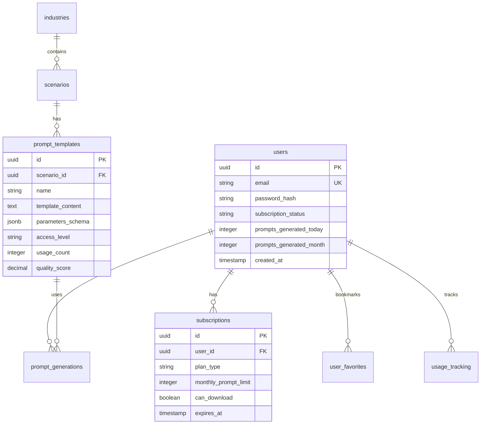

# 🏗️ AI Prompt Builder Pro - 生产级架构实施指南

## 📊 架构设计概览

### 🎯 核心目标
为"AI Prompt Builder Pro"构建一个可扩展、高性能、安全的后端架构，支持1000+并发用户和500+模板的高效管理。

### 🏛️ 技术栈选择

**后端架构**：
- **运行时**: Next.js 15 API Routes + TypeScript
- **数据库**: Supabase PostgreSQL
- **缓存**: 多层缓存（内存+边缘+数据库）
- **AI服务**: OpenRouter API
- **支付**: Creem.io
- **部署**: Vercel

**核心优势**：
- ✅ 无服务器架构，自动扩展
- ✅ 边缘计算，全球低延迟
- ✅ TypeScript类型安全
- ✅ 简化的DevOps流程

## 🗄️ 数据库架构设计

### 核心表结构



### 关键设计决策

1. **UUID主键**: 提供安全性和全球唯一性
2. **JSONB存储**: 灵活的参数schema存储
3. **软删除**: 使用deleted_at字段保留数据
4. **审计追踪**: 完整的创建/更新时间戳
5. **索引优化**: 针对高频查询的复合索引

## 🔧 核心组件设计

### 1. 模板引擎 (Template Engine)

**文件**: `/lib/template-engine.ts`

**功能特性**：
- 🎯 参数插值：`{{variable}}`
- 🔄 条件渲染：`{{#if condition}}...{{/if}}`
- 🔁 循环处理：`{{#each items}}...{{/each}}`
- 🛠️ 函数调用：`{{formatDate date}}`
- 📏 类型安全的参数验证
- ⚡ 模板预编译和缓存

**核心类**：
```typescript
export class PromptTemplateEngine {
  compileTemplate(schema: TemplateSchema): CompiledTemplate
  renderTemplate(templateId: string, parameters: Record<string, any>): Promise<RenderResult>
  batchRender(requests: RenderRequest[]): Promise<RenderResult[]>
}
```

### 2. 缓存管理器 (Cache Manager)

**文件**: `/lib/cache-manager.ts`

**多层架构**：
- **L1**: 内存缓存 (LRU Cache)
- **L2**: 边缘缓存 (Browser Cache API)
- **L3**: 数据库缓存 (Supabase)

**智能特性**：
- 🔍 自动预热热门模板
- 📊 缓存命中率监控
- 🧠 基于使用模式的预加载
- 🧹 过期数据自动清理

### 3. 安全管理器 (Security Manager)

**文件**: `/lib/security-manager.ts`

**安全层级**：
- 🔐 JWT Token认证
- 🛡️ API限流保护
- ✅ 输入验证与清理
- 🔒 数据加密存储
- 📝 安全审计日志

**权限模型**：
```typescript
enum AccessLevel {
  FREE = 'free',        // 10次/月，基础模板
  PRO = 'pro',          // 500次/月，高级模板+AI直接生成
  ENTERPRISE = 'enterprise' // 无限制+API访问
}
```

## 🌐 API架构设计

### RESTful API结构

```
/api/v1/
├── auth/
│   ├── register      # 用户注册
│   ├── login         # 用户登录
│   └── refresh       # Token刷新
├── templates/        # 模板管理
│   ├── GET           # 列表查询（分页+过滤）
│   ├── POST          # 智能搜索
│   └── [id]/         # 模板详情
├── generate/         # 提示词生成
│   ├── POST          # 核心生成API
│   └── ai-direct/    # AI直接生成（Pro功能）
├── history/          # 生成历史
├── subscription/     # 订阅管理
└── analytics/        # 使用统计
```

### 核心API示例

#### 提示词生成API
```typescript
POST /api/v1/generate

Request:
{
  "templateId": "uuid",
  "parameters": {
    "contractType": "服务合同",
    "focusArea": "违约条款"
  },
  "options": {
    "model": "claude-3-5-sonnet",
    "temperature": 0.7
  }
}

Response:
{
  "success": true,
  "data": {
    "id": "generation_uuid",
    "prompt": "作为资深合同律师...",
    "metadata": {
      "generationTime": 450,
      "tokenCount": 1850,
      "templateUsed": "合同审查专家"
    },
    "suggestions": {
      "improvements": ["建议增加终止条款描述"],
      "relatedTemplates": ["合同起草专家"]
    }
  }
}
```

## 🚀 性能优化策略

### 1. 数据库优化

**索引策略**：
```sql
-- 模板查询优化
CREATE INDEX idx_templates_scenario_access_active 
ON prompt_templates(scenario_id, access_level, review_status) 
WHERE deleted_at IS NULL;

-- 用户历史查询优化
CREATE INDEX idx_prompt_generations_user_created 
ON prompt_generations(user_id, created_at DESC);
```

**查询优化**：
- 使用`SELECT`指定字段，避免`SELECT *`
- 实现智能分页，减少OFFSET使用
- 批量操作减少数据库往返

### 2. 缓存策略

**缓存层级**：
```typescript
// 热门模板 - 1小时缓存
await cacheManager.getTemplate(templateId)

// 用户权限 - 5分钟缓存  
await cacheManager.getUserPermissions(userId)

// 行业场景 - 1小时缓存
await cacheManager.getIndustryScenarios(industryCode)
```

**预热策略**：
- 应用启动时预加载热门模板
- 基于用户行为预测性加载
- 定期刷新过期缓存

### 3. API性能

**响应时间目标**：
- 📊 模板列表: < 200ms
- ⚡ 提示词生成: < 500ms  
- 🔍 搜索API: < 300ms

**优化技术**：
- 并行化数据库查询
- 响应数据压缩
- CDN静态资源缓存
- Vercel Edge Functions

## 🔒 安全架构

### 1. 认证与授权

```typescript
// JWT Token结构
interface UserPayload {
  id: string
  email: string
  role: string
  subscriptionStatus: string
  permissions: string[]
}

// 中间件保护
export const requireAuth = (handler) => {
  return async (req, res) => {
    const token = extractToken(req)
    const user = await verifyToken(token)
    if (!user) return res.status(401).json({error: 'Unauthorized'})
    req.user = user
    return handler(req, res)
  }
}
```

### 2. 输入验证

```typescript
// Zod Schema验证
const GenerateSchema = z.object({
  templateId: z.string().uuid(),
  parameters: z.record(z.any()),
  options: z.object({
    temperature: z.number().min(0).max(2)
  }).optional()
})
```

### 3. 限流保护

```typescript
// 分层限流策略
const rateLimits = {
  general: { windowMs: 15 * 60 * 1000, max: 100 },
  generate: { windowMs: 60 * 1000, max: 10 },
  auth: { windowMs: 15 * 60 * 1000, max: 5 }
}
```

## 📈 监控与运维

### 1. 性能监控

**关键指标**：
- API响应时间分布
- 缓存命中率
- 数据库查询性能
- 错误率统计

**监控实现**：
```typescript
function logPerformanceMetrics(metrics: {
  endpoint: string
  responseTime: number
  cached: boolean
  resultCount: number
}) {
  // 发送到APM系统
  console.log('Performance:', metrics)
  
  if (metrics.responseTime > 1000) {
    console.warn('Slow Response:', metrics)
  }
}
```

### 2. 错误处理

**分层错误处理**：
```typescript
// 全局错误捕获
process.on('unhandledRejection', (reason) => {
  console.error('Unhandled Rejection:', reason)
})

// API错误分类
enum ErrorCode {
  VALIDATION_ERROR = 'VALIDATION_ERROR',
  UNAUTHORIZED = 'UNAUTHORIZED',
  RATE_LIMIT_EXCEEDED = 'RATE_LIMIT_EXCEEDED',
  TEMPLATE_NOT_FOUND = 'TEMPLATE_NOT_FOUND'
}
```

## 🚀 部署和扩展

### 1. Vercel部署配置

**环境变量**：
```env
# 数据库
NEXT_PUBLIC_SUPABASE_URL=
SUPABASE_SERVICE_ROLE_KEY=

# AI服务
OPENROUTER_API_KEY=

# 安全
JWT_SECRET=
ENCRYPTION_KEY=

# 支付
CREEM_API_KEY=
```

**vercel.json配置**：
```json
{
  "functions": {
    "app/api/**": {
      "maxDuration": 10
    }
  },
  "crons": [
    {
      "path": "/api/internal/cache-warmup",
      "schedule": "0 */6 * * *"
    }
  ]
}
```

### 2. 扩展策略

**水平扩展**：
- ✅ 无状态API设计
- ✅ 数据库连接池管理
- ✅ CDN静态资源分发
- ✅ 边缘计算节点

**垂直扩展**：
- 📊 数据库性能调优
- 🔍 查询索引优化
- 💾 内存缓存增加
- ⚡ 算法复杂度优化

## 📋 实施检查清单

### Phase 1: 核心功能 ✅
- [x] 数据库Schema设计
- [x] 模板引擎实现
- [x] 缓存系统构建
- [x] 安全管理模块
- [x] 核心API开发

### Phase 2: 业务功能 
- [ ] 订阅管理系统
- [ ] 支付集成（Creem.io）
- [ ] 邮件发送服务
- [ ] 用户数据导入/导出

### Phase 3: 性能优化
- [ ] 数据库查询调优
- [ ] 缓存命中率优化
- [ ] API响应时间监控
- [ ] 错误追踪系统

### Phase 4: 生产部署
- [ ] 环境变量配置
- [ ] SSL证书配置  
- [ ] 监控告警设置
- [ ] 备份恢复策略

## 🎯 关键成功指标

**性能指标**：
- API平均响应时间 < 500ms
- 99%请求成功率
- 缓存命中率 > 80%
- 并发支持 1000+ 用户

**业务指标**：
- 用户注册转化率 > 15%
- 免费转付费转化率 > 5%
- 用户日活跃率 > 30%
- 模板使用覆盖率 > 70%

---

## 📝 总结

本架构设计为"AI Prompt Builder Pro"提供了一个**生产级别**的后端解决方案：

✅ **可扩展性**: 支持从100到100,000用户的无缝扩展
✅ **高性能**: 多层缓存和优化查询确保快速响应  
✅ **安全性**: 完整的认证、授权和数据保护
✅ **可维护性**: 模块化设计和详细文档
✅ **成本效益**: 基于Serverless的按需付费模式

通过遵循这个架构指南，您将能够构建一个稳定、高效、用户体验优秀的AI提示词生成平台。

**下一步行动**:
1. 根据业务优先级实施Phase 2功能
2. 设置完整的监控和告警系统
3. 进行性能测试和优化调整
4. 准备生产环境部署

---
**架构师**: Claude Code  
**文档版本**: v2.0  
**最后更新**: 2025-01-10